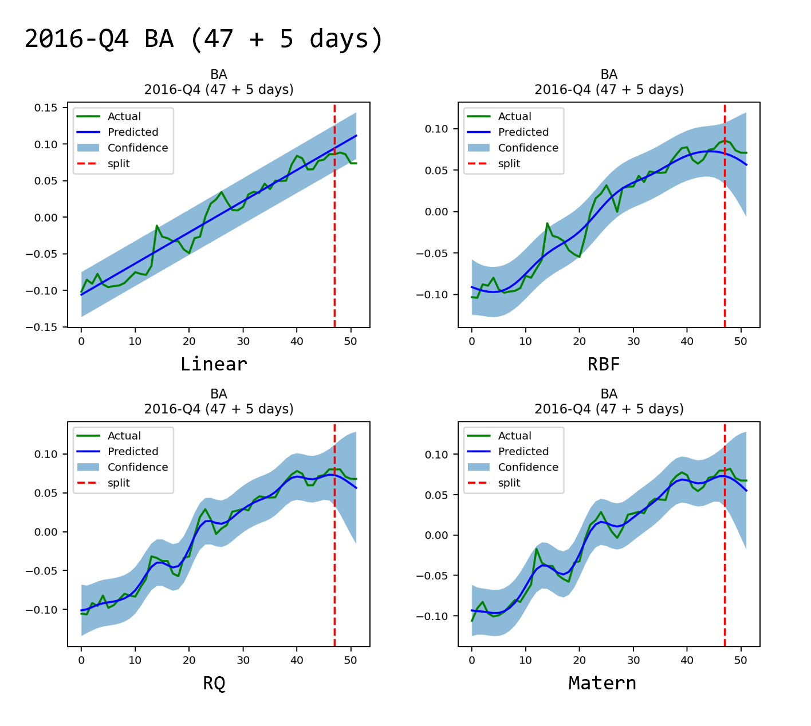
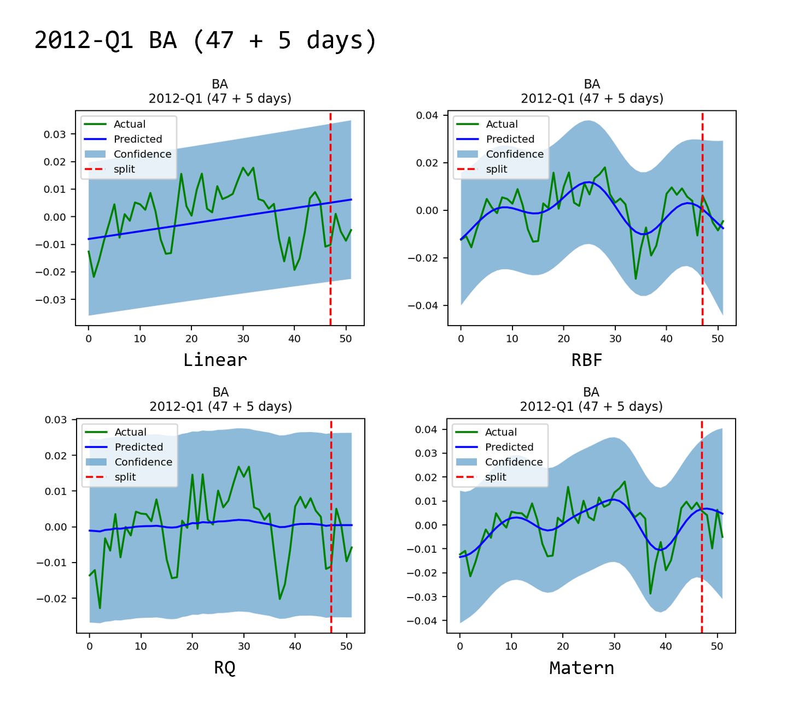
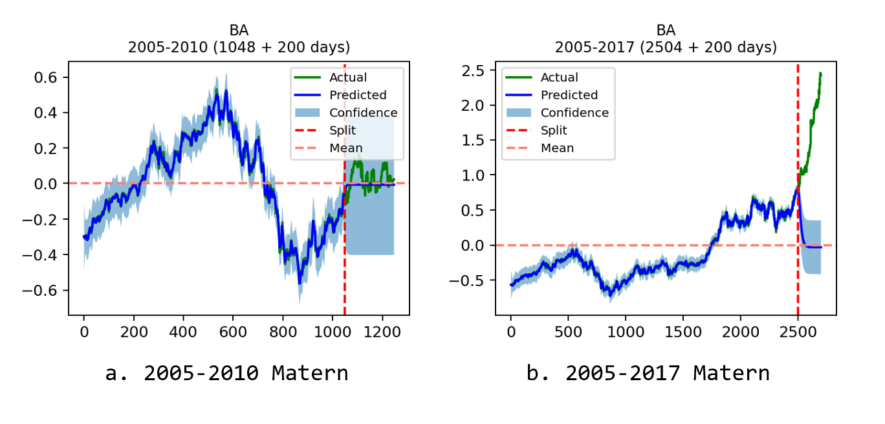

# Stocastic-GaussianProcess

*To simplify expressions, I call Gaussian Process as GP in this document*

### Dependencies

For this project, we are yet to provide you with a specification list, but you can run the prompts line-by-line to get the dependencies ready.

```shell
pip install pandas=1.5.3
pip install matplotlib
pip install scikit-learn
pip install ipykernel
pip install plotly
pip install ipywidgets
pip install nbformat
pip install torch (2.0.0+cu117 version, check official document when installing)
pip install gpytorch
pip install tqdm
```

### Before you run the code

I did not code the part where you create a folder if it didn't exist. In the mean time, I have not synced all my running results to github, for its quite a burden. Because of that, **DO REMEMBER** to create these folders (from the root folder of your project, as the following folder tree suggests) for successfully storing your results.

- result
- img
  - BA
  - GSPC
  - SBUX

### Parts

- Interactive visualization of GP: getting to know GP 101 (at gp-theory folder)
  - This is a revised version from a Youtube Tutorial. For original content, you can find it [here](https://gitlab.com/youtube-optimization-geeks/uncertainty-quantification).
- Project: using GP regression to predict stock prices
  - data_processor.py: dataloader and data preprocessing classes.
  - gp_operations.py: single run of GP(ExactGP), realized in [GPyTorch](https://gpytorch.readthedocs.io/).
  - sklearn_main.py: sklearn implementation of GP (not sure if it still work, it might not with the latest version of my dataloader).
  - test.py: batch testing for multiple years to create graphs and results at result and img folders. You need it when you want to find a trend in all your predictions. Current version supports quarterly data.
  - utils.py: graphing in matplotlib.

### Dataset

From [Roguski's repo](https://github.com/gdroguski/GaussianProcesses). Roguski's repo provided an excellent implementation of GPs in Scikit-Learn. Got a lot of inspirations from his repo. Hats off to him.

### Tasks & Results

In this implementation, I tried to predict stock price variance in 5 days. Preprocessing include centering and unifying the trading days for each quarter. Please refer to the code for details.

Also, I have compared different Kernel functions (or covariance functions). I have picked out one good case and a bad case to show you the gist.

- good case (2016-Q4)




- bad case (2012-Q1)



Besides, my model does not fare well in predicting long-term results. I believe this is in line with the Gaussian Process assumption that the data is a normal distribution ($N \sim (0, \sigma^2)$).

